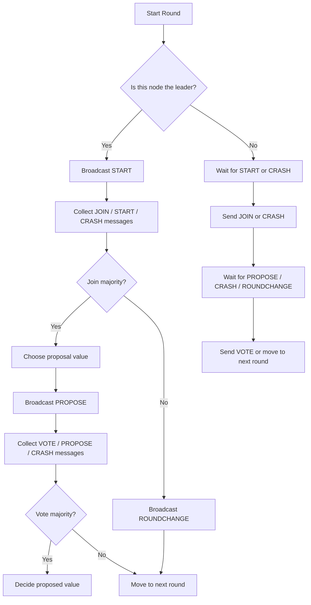

# 🧠 Synchronous Paxos Binary Consensus Algorithm Simulator


## 📌 Overview

This project implements a **synchronous version of the Paxos consensus algorithm** for solving the **binary consensus problem**.

In binary consensus, multiple distributed nodes try to agree on a single value where the only valid values are:

```text
0 or 1
```

The implementation simulates a distributed system using multiple Python processes. Each process represents one Paxos node, and nodes communicate through **ZeroMQ sockets**. The system also simulates temporary crash failures by replacing normal protocol messages with `CRASH` messages according to a user-provided probability.

The project contains **two Paxos implementations**:

| File | Implementation Type | Description |
|---|---|---|
| `paxos.py` | Barrier-based synchronous Paxos | Main implementation that uses a multiprocessing barrier to synchronize nodes between phases. |
| `paxos_barrier_free.py` | Barrier-free Paxos | Bonus implementation that avoids barriers and manually handles early or late messages from neighboring rounds. |

---

## 🎯 Project Goal

The goal of the project is to implement a modified Paxos algorithm for a synchronous system where nodes execute in rounds and attempt to agree on a binary value.

The algorithm must preserve the key safety properties of consensus:

### Agreement

If multiple rounds reach a decision, all decided values must be the same.

### Validity

Any decided value must be one of the original values proposed by the Paxos nodes.

### Termination Model

The project does not require guaranteed termination under arbitrary probabilistic failures. Instead, all nodes execute for a fixed number of rounds given as a command-line argument.

---

## 🧩 Problem Model

Each Paxos node is initialized with:

- a unique process ID
- an initial binary value, either `0` or `1`
- the total number of nodes
- a crash probability
- the number of rounds to execute

A node can behave as either:

- **Leader / Proposer** for a round
- **Acceptor** for all other rounds

Leadership is assigned in round-robin order:

```text
leader = current_round % number_of_nodes
```

For example, if there are 4 nodes:

| Round | Leader |
|---|---|
| 0 | Node 0 |
| 1 | Node 1 |
| 2 | Node 2 |
| 3 | Node 3 |
| 4 | Node 0 |

---

## 🏗️ Project Structure

```text
./
├── paxos.py                  # Main barrier-based synchronous Paxos implementation
├── paxos_barrier_free.py     # Bonus barrier-free Paxos implementation
```

---

## ⚙️ Technologies Used

- **Python 3**
- **ZeroMQ / pyzmq**
- **Python multiprocessing**
- **PUSH / PULL socket communication**
- **Process-based distributed system simulation**
- **Probabilistic crash simulation**

---

## 🚀 Running the Project

Install the required dependency:

```bash
pip install pyzmq
```

Run the barrier-based implementation:

```bash
python3 paxos.py <numProc> <crashProbability> <numRounds>
```

Example:

```bash
python3 paxos.py 5 0.2 4
```

Run the barrier-free implementation:

```bash
python3 paxos_barrier_free.py <numProc> <crashProbability> <numRounds>
```

Example:

```bash
python3 paxos_barrier_free.py 5 0.2 4
```

### Command-Line Arguments

| Argument | Description |
|---|---|
| `numProc` | Number of Paxos nodes/processes |
| `crashProbability` | Probability that a protocol message is replaced by a `CRASH` message |
| `numRounds` | Number of Paxos rounds to execute |

Example:

```bash
python3 paxos.py 4 0.1 3
```

This starts 4 Paxos processes, uses a 10% simulated crash probability, and runs the protocol for 3 rounds.

---

## 🔌 Network Design

The project uses a local ZeroMQ network topology.

Each node creates:

- one `PULL` socket to receive messages
- one `PUSH` socket for every node in the system

Each node binds its `PULL` socket to a unique local port:

```text
5550 + node_id
```

For example:

| Node | Port |
|---|---|
| Node 0 | `5550` |
| Node 1 | `5551` |
| Node 2 | `5552` |
| Node 3 | `5553` |

Each node stores its outgoing sockets in a list:

```python
pushSockets[i]
```

This allows a node to send a message directly to node `i`.

---

## 🔁 Paxos Round Flow

Each round has two main phases:

1. **JOIN phase**
2. **VOTE phase**



---

## 🧠 Core Paxos State

Each node maintains the following local variables:

| Variable | Purpose |
|---|---|
| `maxVotedRound` | Highest round number this node has voted in |
| `maxVotedVal` | Value voted for in `maxVotedRound` |
| `proposeVal` | Value selected by the current leader to propose |
| `decision` | Stores the decided value if a decision is reached |

Initially:

```python
maxVotedRound = -1
maxVotedVal = None
proposeVal = None
decision = None
```

The leader uses `maxVotedRound` and `maxVotedVal` from JOIN messages to preserve Paxos safety. If any node in the quorum has voted before, the leader proposes the value associated with the highest voted round. If no previous vote exists, the leader proposes its own initial value.

---

## 💥 Crash Simulation Design

The project does not actually terminate or suspend processes. Instead, failures are simulated at the message level.

Before sending important protocol messages, a random probability is generated. If the generated value is less than or equal to the input crash probability, the sender sends:

```text
CRASH <leader_id>
```

Otherwise, it sends the normal Paxos message.

Examples of normal messages:

```text
START
JOIN <maxVotedRound> <maxVotedVal>
PROPOSE <value>
VOTE
ROUNDCHANGE
```

Examples of simulated crash messages:

```text
CRASH 0
CRASH 1
CRASH 2
```

This design makes failures temporary and probabilistic while keeping all Python processes alive until the fixed number of rounds is complete.

---

## ✅ Implementation 1: `paxos.py`

`paxos.py` is the main implementation of the project.

It uses:

- `multiprocessing.Process` to create Paxos nodes
- `multiprocessing.Barrier` to synchronize nodes
- ZeroMQ `PUSH` and `PULL` sockets for message passing
- round-robin leader selection
- majority-based JOIN and VOTE quorums

### Barrier-Based Synchronization

The barrier is created in the main process:

```python
barrier = multiprocessing.Barrier(numProc)
```

The same barrier object is passed to every Paxos process.

At the end of important phase transitions, nodes call:

```python
barrier.wait()
```

This prevents fast nodes from moving too far ahead of slower nodes.

### Why the Barrier Is Useful

Without synchronization, one node might already move to round `r + 1` while another node is still waiting for a message from round `r`.

That can create confusing cases such as:

- receiving a `START` message while expecting `PROPOSE`
- receiving a `PROPOSE` from the previous round while already in the next round
- receiving `ROUNDCHANGE` late
- counting a next-round message as if it belonged to the current round

The barrier-based version avoids these cases by forcing all nodes to wait before advancing.

### Leader Behavior

In each round, the leader:

1. broadcasts `START`
2. collects `JOIN`, `START`, or `CRASH` messages
3. checks whether a majority joined
4. chooses a safe proposal value
5. broadcasts `PROPOSE`
6. collects `VOTE`, `PROPOSE`, or `CRASH` messages
7. decides if a majority voted

If the leader cannot collect a JOIN majority, it sends:

```text
ROUNDCHANGE
```

and the system moves to the next round.

### Acceptor Behavior

An acceptor:

1. waits for `START` or `CRASH`
2. responds with `JOIN` or `CRASH`
3. waits for `PROPOSE`, `CRASH`, or `ROUNDCHANGE`
4. updates its vote state if it receives `PROPOSE`
5. responds with `VOTE` or `CRASH`

---

## 🧪 Implementation 2: `paxos_barrier_free.py`

`paxos_barrier_free.py` is the bonus implementation.

It follows the same Paxos logic but removes the barrier. Because there is no explicit synchronization point, nodes may receive messages from adjacent rounds while they are still processing the current round.

To handle this, the implementation uses extra state flags:

```python
leaderRecievedNextRoundsCrash
leaderRecievedNextRoundsStart
acceptorRecievedNextRoundCrash
acceptorRecievedNextRoundStart
```

These flags remember early messages from the next round.

### Barrier-Free Design Choice

Instead of blocking all processes at a barrier, this version tries to classify every incoming message based on the current local phase.

For example:

- If a leader is collecting votes for round `r` and receives a `START` from round `r + 1`, it does not count that message as a vote.
- If an acceptor receives a next-round crash message early, it stores that fact and responds when it reaches the next round.
- If an acceptor receives a previous-round `PROPOSE`, it can still update its voted value and respond to the previous leader.

This version is more complex because synchronization is no longer handled by a shared primitive. Instead, correctness depends on carefully handling all possible message interleavings.

### Main Difference from `paxos.py`

| Feature | `paxos.py` | `paxos_barrier_free.py` |
|---|---|---|
| Synchronization method | `multiprocessing.Barrier` | Manual message classification |
| Complexity | Simpler and more stable | More complex bonus version |
| Early next-round messages | Prevented by barrier | Stored using flags |
| Late previous-round messages | Mostly avoided | Handled explicitly |
| Design style | Lock-step execution | Event/interleaving-aware execution |

---

## 🖨️ Output Format

The program prints key protocol events such as:

```text
NUM_NODES: 4 , CRASH PROB: 0.1 , NUM_ROUNDS: 3
ROUND 0 STARTED WITH INITIAL VALUE: 1
LEADER OF 0 RECEIVED IN JOIN PHASE: JOIN -1 None
ACCEPTOR 2 RECEIVED IN JOIN PHASE: START
LEADER OF 0 RECEIVED IN VOTE PHASE: VOTE
LEADER OF 0 DECIDED ON VALUE 1
```

The output is intentionally verbose so that the execution of each Paxos round can be followed from the terminal.

---

## 🧭 Design Choices Summary

### Process-per-node model

Each Paxos node runs as a separate operating system process. This better simulates a distributed system than running all nodes as normal function calls in a single process.

### ZeroMQ PUSH/PULL communication

ZeroMQ provides lightweight local message passing between processes. The `PUSH`/`PULL` pattern is simple and fits the project requirement because each process can directly send protocol messages to any other process.

### Round-robin leadership

The leader is selected deterministically with:

```python
currentRound % numProc
```

This keeps leader selection simple and ensures every node gets a chance to propose.

### Majority quorums

The implementation uses majority checks:

```python
count > numProc / 2
```

A majority quorum is required for both JOIN and VOTE phases. This is essential for Paxos safety because any two majorities must overlap.

### Message-level crash simulation

Instead of killing processes, the program simulates crashes by sending `CRASH` messages. This keeps the program easier to run, debug, and terminate while still modeling temporary node failures.

### Fixed round count

Because probabilistic crashes can prevent progress, the program runs for a fixed number of rounds instead of waiting indefinitely for a decision.

---

## 📌 Notes

- The code uses local ports starting from `5550`.
- If a previous run does not terminate cleanly, wait a moment before running again so the ports can be released.
- The barrier-based implementation is the clearer and safer baseline.
- The barrier-free implementation demonstrates the more advanced bonus approach where synchronization is handled through message logic instead of a shared barrier.

---

## 🔮 Possible Improvements

- Replace the fixed `time.sleep(5)` startup delay with an explicit socket readiness mechanism.
- Extract repeated crash-simulation logic into helper functions such as `sendFailure()` and `broadcastFailure()`.
- Close ZeroMQ sockets and terminate contexts explicitly at shutdown.

---

## 👤 Author

Ege Ata Ceylan
